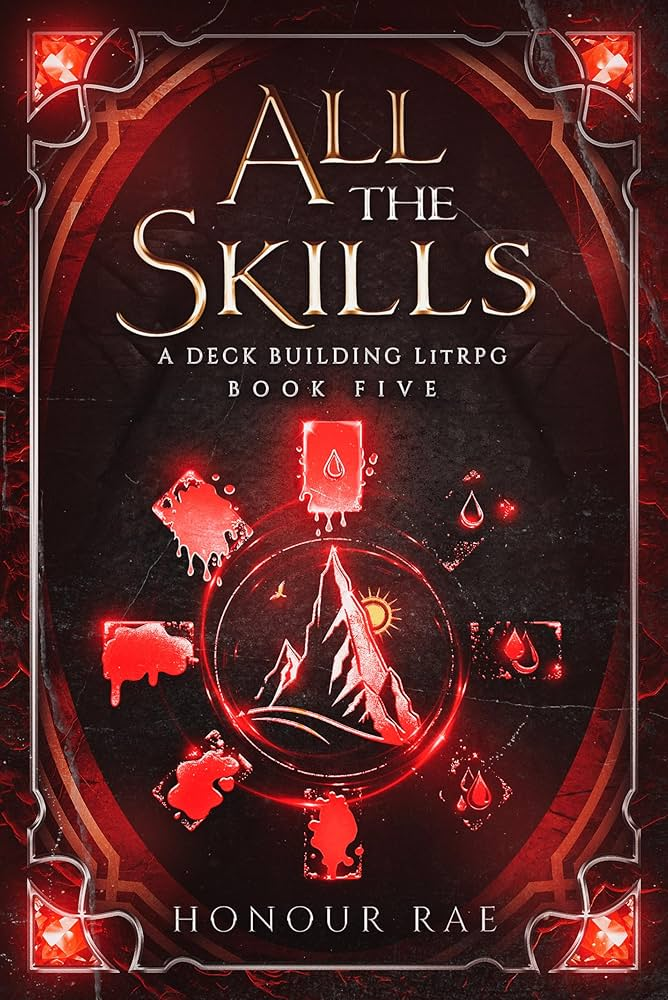

**Rating:** ⭐️⭐️⭐️⭐️☆ (4.5/5)  
**Verdict:** *"The card system and dragon lore shine, but uneven pacing holds it back from perfection."*

### 📖 Spoiler-Free Summary
Arthur and Brixby return to the kingdom under the Mythic dragon's orders, but their journey takes them to a new hive where they must balance political intrigue with raising a wing of purple dragons. Perfect for:
- **Card system enthusiasts** (strategic deck-building)
- **Dragon bond lovers** (rider dynamics)
- **Unique magic seekers** (no generic spell slinging)

### 📊 LitRPG Scorecard
| **Category**          | **Rating** | **Highlights** |
|-----------------------|------------|----------------|
| **Progression System** | ⭐️⭐️⭐️⭐️⭐️ (5) | Card combos reach new strategic depth |
| **World-Building**     | ⭐️⭐️⭐️⭐️☆ (4.5) | Hive culture feels authentic |
| **Character Growth**   | ⭐️⭐️⭐️☆ (3.5) | Brixby shines; Arthur stagnates |
| **Pacing**            | ⭐️⭐️⭐️☆ (3.5) | Drags during shard sequences |
| **Overall**           | ⭐️⭐️⭐️⭐️☆ (4.5) | Flawed but essential |

### ✅ What Works
- **Brixby's maturity** with the purple dragons
- **"Call of Void" portal** mysteries
- **Chekhov's Gun** card payoff system

### ❌ What Doesn't
- Retinue gets sidelined
- Arthur's stagnant development
- Cresedia's cards underutilized

### 🎯 Perfect For Readers Who Love:
- **Card game strategists** (*Slay the Spire* deck-building fans)  
- **Dragon bond mechanics** (Rider-hatchling dynamics)  
- **Tactical problem-solving** over brute-force combat  

### 🚫 May Disappoint Those Who Want:
- **Nonstop action** (This rewards patience)  
- **Power fantasies** (MC wins through wits, not stats)  
- **Fast-paced character arcs** (Brixby grows; Arthur simmers)  

### 📚 Where to Find
 | [Goodreads]() | [Litrpg Books Catalog]()

