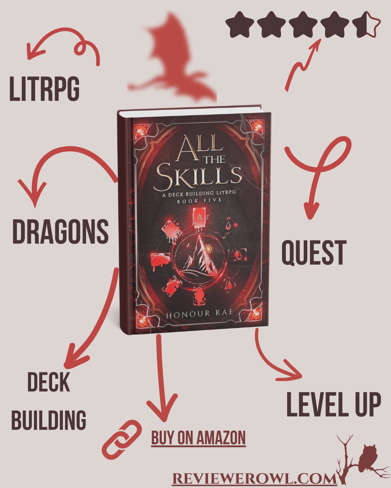

**Rating:** ⭐️⭐️⭐️⭐️☆ (4.5/5)  
**Verdict:** *"The card system and dragon lore shine, but uneven pacing holds it back from perfection."*

### 📖  Summary
Story starts with seeking another card for Brixby’s legendary deck. For searching this new card, our group travelled to another hive (Blood Moon Hive) in the kingdom (let’s not forget they’re currently outside the kingdom). They found an illusion card to show their ranks one rank lower (legendary → rare, rare → uncommon) and infiltrate Blood Moon Hive to find the card.

The card shows erratic behaviour, and they can’t locate it, so they need to spend more time in the hive. Blood Moon Hive is a little orthodox—they require "blood" sacrifice if they (dragon + rider) don’t fulfill their shard quota.

For the rest of the story, read the [book](https://amzn.to/3YMUc18). I think this is enough to convince you whether you need to read it or not.

### 📊 LitRPG Scorecard
| **Category**          | **Rating** | **Highlights** |
|-----------------------|------------|----------------|
| **Progression System** | ⭐️⭐️⭐️⭐️⭐️ (5)  | Functional and original. I love pair dynamics and set of cards and card grades (legendary, rare, uncommon, common) |
| **World-Building**     | ⭐️⭐️⭐️⭐️☆ (4.5) | I love the pair dynamics and hints that this may be our world in future. |
| **Character Growth**   | ⭐️⭐️⭐️☆☆  (3.5) | I like how Brixby builds character but Arthur stagnates. Side characters were close to non-existent. |
| **Stakes/Tension**     | ⭐️⭐️⭐️⭐️⭐️ (5)  | Their utility-oriented cards always increase tension. They find good original solutions. |
| **Pacing**             | ⭐️⭐️⭐️☆☆  (3.5) | Sidetracked on eruption diving and harvesting new shards, but I think it is necessary for whole story (I hope)." |
| **Overall**            | ⭐️⭐️⭐️⭐️☆ (4.5) | It is good but could be better. I have high hopes for next book.|

### ✅ What I like
- How Brixby grows, owns responsibility, and builds his character.

- How Brixby and Arthur embrace purple dragons and grow/nurture them.

- Arthur’s card-restore ability develops well and has good potential.

- I like Brixby’s new portal ability. It’s ominous and mysterious. It seems the rower in the portal will answer many mysteries in the future.

- I always like to see new dragon-human pair matches, and this was no exception. I like how they matched at the hatchery.

- When you see a gun in a scene, you know it will fire. When you see a new card in this book, you know it will be used—and you can try to forecast the possibilities. I like that.

### ❌ What I Don’t Like
- I expected Arthur & Brixby to spend more time with their newly built team (retinue), but they focused on purples.

- Arthur feels a little stagnant in this book. Even though he shined in the previous book—and this was expected—I still didn’t like it.

- Cresedia has a new card group, and we only skimmed them in a brief battle. I expected a more epic battle.

### 🎯 You'll Love This If You Enjoy:
- **Creative magic systems** - The card-based powers feel fresh with endless combo potential  
- **Dragon partnerships** - The bond between riders and hatchlings has real depth and consequences  
- **Smart protagonists** - Arthur and Brixby win through strategy, not just brute strength  

### ⚠️ Be Aware If You Prefer:
- **Fast-paced action** - Some sections focus on card mechanics/dragon care (world-building payoff later)  
- **Solo heroes** - This is very much a duo story - side characters get less spotlight  
- **Quick power gains** - Progress feels earned through clever card use, not sudden upgrades  

### 📚 Where to Find
 | [Goodreads]() | [Litrpg Books Catalog]()

