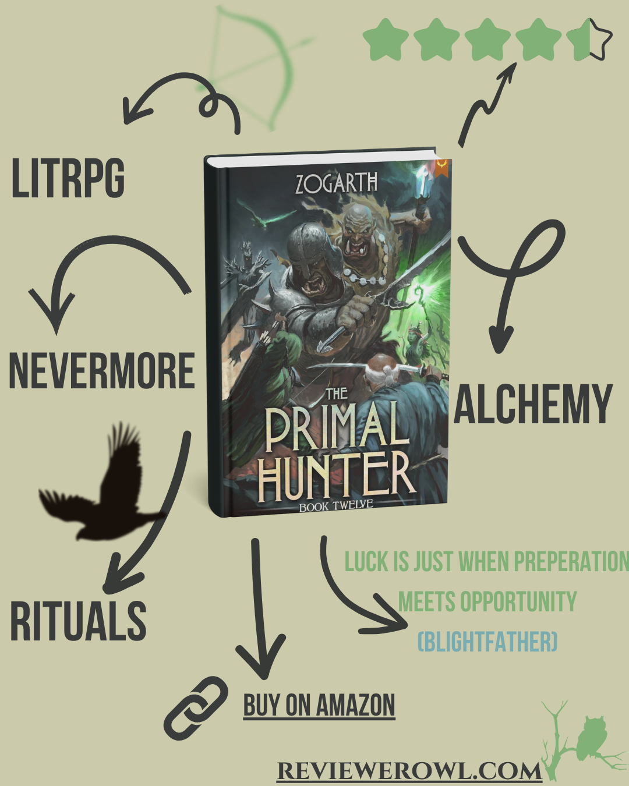

**Rating:** ⭐️⭐️⭐️⭐️☆ (4.5/5)  
**Verdict:** *"A well-paced but slightly dull transition book that successfully closes the Nevermore chapter, setting the stage for a new adventure."*

### 📖  Summary
The story kicks off in the final dungeon of Nevermore, and in a fun twist, Jake finds himself working as a courier. It gives off serious [Postknight](https://postknight.com/) or *[This Quest is Broken!](https://amzn.to/43EPgxB)* vibes, which was a fresh change of pace.

Without giving too much away, the political plot gets resolved in a very... Jake-like style. (You'll need to read it to see what I mean!). As the Blightfather wisely states in the book: *"Luck is just when preparation meets opportunity."*

Nevermore's scores finally come out with the expected results, the core team gets back together for one last fight on the final floor, and Sylvie's stubbornness pays off beautifully as "the wind bends its will in front of her." We also get another ritual—Jake is becoming a full-blown ritualist book by book, and I'm here for it. The story wraps with Jake returning to meet the Wyvern atop the mountain from a few books back.

Overall, it feels a bit dull at times, but I think this is a necessary evil. Some long-running loose ends are tightened, the big Nevermore chapter ends with this book, and we're ready for a new adventure in the next one.

### 📊 LitRPG Scorecard
| **Category**          | **Rating** | **Highlights** |
|-----------------------|------------|----------------|
| **Progression System** | ⭐️⭐️⭐️⭐️⭐️ (5)  | Well-designed character and skill system that remains a cornerstone of the series. |
| **World-Building**     | ⭐️⭐️⭐️⭐️⭐️ (5)  | I love the relationship between gods and characters. The structured path to godhood and the skill system are top-tier. |
| **Character Growth**   | ⭐️⭐️⭐️☆☆  (3.5) | Sylvie's development, both mentally and power-wise, was great. Jake didn't develop much but confirmed his path (you know, refusing to die and all that). |
| **Stakes/Tension**     | ⭐️⭐️⭐️☆☆  (3.5) | Jake didn't face any real challenge that felt threatening. The highest tension was definitely around Sylvie. |
| **Pacing**             | ⭐️⭐️⭐️⭐️☆ (4.5) | Had a good pace to finish the Nevermore story and didn't lose speed while tying up loose ends. |
| **Overall**            | ⭐️⭐️⭐️⭐️☆ (4.5) | A well-paced but slightly dull book in the series, which is expected as we close the Nevermore episode. I have high hopes for the next one! |

### ✅ What I like
- Seeing Jake start from the bottom again as a courier and progress from there. It's a classic trope, and it works.

- How Jake becomes a double agent just by being... well, Jake. It's perfectly in character.

- The Primordials just sitting in a room and casually chit-chatting. It's as awesome and terrifying as it sounds.

- I like the growing mystery around the First Sage. He's slowly becoming the central missing piece of the puzzle.

### ❌ What I Don't Like
- While seeing Jake as a courier was fun, other parts of the book felt a bit dull.

- We didn't see a lot of meaningful power progression for Jake this time around.

- The book feels a little superficial in places. However, this is somewhat expected when you're ending a major story arc and need to clean house before the next big adventure.

### 🎯 You'll Love This If You Enjoy:
- **Satisfying Arc Conclusions** - This book neatly ties a bow on the long-running Nevermore storyline.
- **Godly Politics** - The interactions between deities, primordials, and humans are as engaging as ever.
- **Character-Driven Progression** - Watching Sylvie and the supporting cast get their moments to shine.

### ⚠️ Be Aware If You Prefer:
- **High-Octane Action** - This is more of a transitional book, focusing on setup and resolution over constant battles.
- **Major Power-Ups** - Jake's growth is more about consolidating his path than gaining new, flashy abilities.
- **Standalone Stories** - This book is deeply dependent on the previous entries and is all about setting the stage for what's next.

### 📚 Where to Find
 | [Goodreads]() | [Litrpg Books Catalog]()
